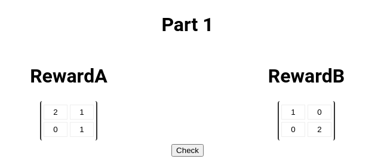
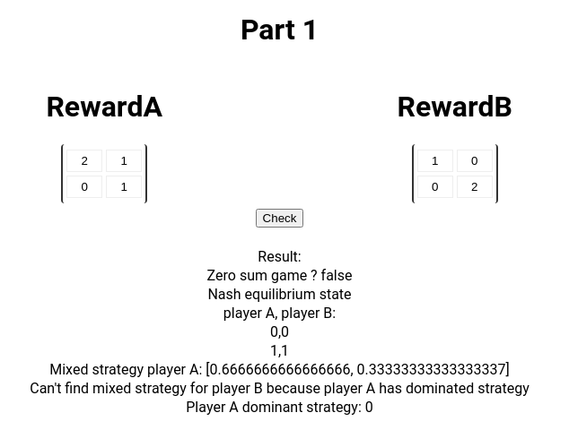
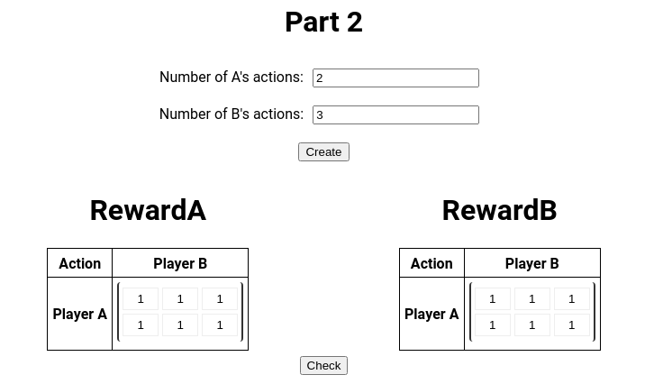
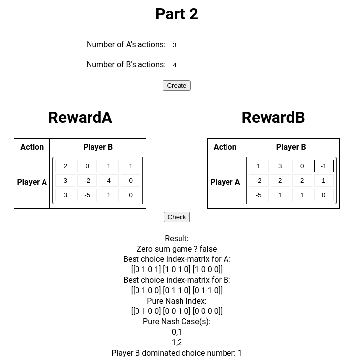

---
title: "Theorie Des Jeux"
author: \textbf{DO Duy Huy Hoang} \newline
        \newline
        \textit{University of Limoges} \newline 
date: \today
titlepage: false
header-includes: |
    \usepackage{multicol}
    \usepackage{graphicx}
footer-left: DO Hoang
mainfont: NewComputerModern
sansfont: NewComputerModern
monofont: Dank Mono
caption-justification: centering
...
\pagenumbering{Roman} 

\newpage{}
\listoftables
\newpage{}
\listoffigures
\newpage{}
\tableofcontents
\newpage{}

\pagenumbering{arabic} 

\vspace{3cm}
\newpage{}

\pagenumbering{arabic} 

# I. Introduction

## 1.1 Objectives

The game theory project consists of three problems and in all problems, I will determine:

- If the game is zero-sum or not
- Pure Nash equilibria
- The dominated strategies, and if there are the dominant strategies

## 1.2 Project structures

The project structure will be divided into three parts following the requirement and also an extra part.
The first section is a game with two players and they have two strategies, the second part will be two players but multiple strategies per player. The next part is to make a three players game with three actions for each, and the extra part I will work with multiple player with multiple strategies for each player.

# II. Programs and Materials

For the graphical user interface part, I create a web application by using `React` for front-end part and `Golang` for backend server. The reason I chose this stack because it is easier to create UI in web base and also I am more familiar with Javascript and Golang.

**Requirement**

- NodeJS
- Go

**Dependencies**

- React
- Gin and Static middleware for Golang

**Installation, Running and testing**

- Download and extract the project
- `npm install` (install dependencies)
- `npm run-script build`
- `go run ./main.go`
- Use your browser and go to `localhost:8082`


# Methodology

## Problem 1 - game of 2 players with 2 strategies

In this problem, There will be two player named as A and B. The strategy that a player can input utilizing number begun from 0, such as strategy ”1”, strategy ”2”,..., and it is interpreted as the reward tables below.


Table: (Reward for Player A)

|Reward A  |        | Player B |   |
|----------|--------|----------|---|
|          | Action | 0        | 1 |
| Player A | 0      | 2        | 1 |
|          | 1      | 0        | 1 |


Table: (Reward for Player B)

|Reward B  |        | Player B |   |
|----------|--------|----------|---|
|          | Action | 0        | 1 |
| Player A | 0      | 1        | 0 |
|          | 1      | 0        | 2 |

User interface:



We created the interface same as our input so that the strategy and reward will be represented as array
`[[2 1] [0 1]]` for player A and `[[1 0] [0 2]]` for player B.

### Zero sum 

In game theory, a zero-sum game is a mathematical representation of a situation in which an advantage that is won by one of two sides is lost by the other. In order to find out, we will check the reward of both players ( the total gains and the total losses), if the reward sum equal to zero (the total gains are ended up and total lesses are subtracted ).

```Golang
func CompareMatrix(mat1 [][]int, mat2 [][]int) bool {
	row := len(mat1)
	if row != len(mat2) {
		return false
	}
	for i := 0; i < row; i++ {
		col := len(mat1[i])
		if col != len(mat2[i]) {
			return false
		}
		for j := 0; j < col; j++ {
			if mat1[i][j] != mat2[i][j] {
				return false
			}
		}
	}
	return true
}
```

### Pure Nash equilibrium state

In pure strategy, if  player A play a (with probability 1), player B can play for example the same action a but with probability 1 so that there will be no random play (pure nash equil state). A Nash equilibrium is a set of strategies, one for each player, such that no player has incentive to change his or her strategy given what the other players are doing. The first problem is two players versus game so that we can use brute force method to check every strategy, in each strategy, we find if there exist a better action for a player.

```Golang
func CheckBetter(pA [][]int, pB [][]int, i int, j int) bool {
	//pA check
	for k := 0; k < 2; k++ {
		if pA[k][j] > pA[i][j] {
			return true
		}
	}
	//pB check
	for k := 0; k < 2; k++ {
		if pB[i][k] > pB[i][j] {
			return true
		}
	}
	return false
}

result = result + "Nash equilibrium state <br/>player A, player B:<br/>"
for i := 0; i < 2; i++ {
	for j := 0; j < 2; j++ {
		existBetter := CheckBetter(pA, pB, i,j)
		if !existBetter {
			fmt.Printf("%d,%d\n", i, j)
			result = result + fmt.Sprintf("%d,%d<br/>", i, j)
		}
	}
}

```

### Mixed Strategy

A mixed strategy of player i is a measure of probability pi defined on the set of pure strategies
of player i. We denote the set $P_{i}$ the set of mixed strategies of player i. $p_{i}$, $s_{i}$ is the probability that i will play the pure strategy si. $p_{i}$ in $P_{i}$ therefore corresponds to a mixed strategy of player i.

For example, if we want to find a mixed strategy for player A, we will calculate the probability for each
choice of player A so that the expectation values for every choice of B is equal. We applied the equation below to calculate the probability of player A pick `0` and the probability of player B pick `1` is equal to `1-pa`. B_{(0,1)} is the award for player B when player A pick choice `0` and player B pick choice `1`.

\begin{equation}
p_{A} = \frac{-B_{(0,1)} + B_{(1,1)}}{ B_{(0,0)} - B_{(1,0)} - B_{(0,1)}+ B_{(1,1)}} 
\end{equation}
\begin{equation}
p_{B} = \frac{-A_{(0,1)} + A_{(1,1)}}{ A_{(0,0)} - A_{(1,0)} - A_{(0,1)}+ A_{(1,1)}}
\end{equation}

```Golang
//find mixed Nash
var probA, probB float64
probA = float64(-pB[1][0] + pB[1][1]) / float64(pB[0][0] - pB[1][0] - pB[0][1] + pB[1][1])
probB = float64(-pA[0][1] + pA[1][1]) / float64(pA[0][0] - pA[0][1] - pA[1][0] + pA[1][1])
if probA >= 1 || probA <= 0 {
	fmt.Println("Cannot find mixed strategy for player A because player B has dominated strategy")
	result = result + "Player B has dominated strategy => No mixed strategy for player A<br/>"
	_, y := IndexMaximalElement(pB)
	fmt.Printf("Player B dominant strategy: %d\n", y)
	result = result + fmt.Sprintf("Player B dominant strategy: %d<br/>", y)
} else {
	fmt.Printf("Mixed strategy player A: [%g, %g]\n", probA, 1-probA)
	result = result + fmt.Sprintf("Mixed strategy player A: [%g, %g]<br/>", probA, 1-probA)
}
if probB >= 1 || probB <= 0 {
	fmt.Println("Cannot find mixed strategy for player B because player A has dominated strategy")
	result = result + "Player A has dominated strategy => No mixed strategy for player B<br/>"
	x, _ := IndexMaximalElement(pA)
	fmt.Printf("Player A dominant strategy: %d\n", x)
	result = result + fmt.Sprintf("Player A dominant strategy: %d<br/>", x)
} else {
	fmt.Printf("Mixed strategy player B: [%g, %g]\n", probB, 1-probB)
	result = result + fmt.Sprintf("Mixed strategy player B: [%g, %g]<br/>", probB, 1-probB)
}
```

**Result**



## Problem 2 - game of 2 players with multiple strategies

In this problem, There will be two player named as A and B. The strategy that a player can input utilizing number begun from 0, such as strategy ”1”, strategy ”2”,..., 
The player A will have N choice from `0` to `N-1`, and player B will have M choice from `0` to `M-1` and it is interpreted as the reward tables below.

Table: (Reward for Player A - Multiple action)

|Reward A  |        |     |     | Player B |     |
|----------|--------|-----|-----|----------|-----|
|          | Action | 0   | 1   | ...      | M-1 |
|          | 0      | 1   | 1   | ...      | ... |
| Player A | 1      | 2   | 0   | ...      | ... |
|          | ...    | ... | ... | ..       | ... |
|          | n-1    | ... | ... | ...      | ... |

Table: (Reward for Player B - Multiple action)

|Reward B  |        |     |     | Player B |     |
|----------|--------|-----|-----|----------|-----|
|          | Action | 0   | 1   | ...      | M-1 |
|          | 0      | 1   | 1   | ...      | ... |
| Player A | 1      | 2   | 0   | ...      | ... |
|          | ...    | ... | ... | ..       | ... |
|          | n-1    | ... | ... | ...      | ... |

**input** `SolvePart2(n, m int, pA, pB [][]int)` where `n` and `m` is the number choices of player A and player B and pA and pB is the table reward of each player in array datatype.

**User interface:**



The user will fill the number of action for both players and the application will generate the reward table following the players choice actions's input.

### Zero-sum

Im using the same function as the Part 1 because the checking process is similar.

### Nash equilabrium
 
In this project, we will find the best choice of A for each choice of B (max of each column) and do the same thing for B with max of each row.

```Golang
func GetMaxAOneHot(n, m int, mat [][]int, max []int) [][]int {
	maxOneHot := make([][]int, n)
	for i := 0; i < n; i++ {
		maxOneHot[i] = make([]int, m)
	}

	for j := 0; j < m; j++ {
		for i := 0; i < n; i++ {
			if mat[i][j] == max[j] {
				maxOneHot[i][j] = 1
			}
		}
	}

	return maxOneHot
}
```

We will mark the choice `1` if it is the best choice to response to the other player choice. 
After that we find the pure Nash by multiply two matrix cell by cell. If both players have a same case as their best choice, that case is considered as Nash
equilibrium state.

We will mark the choice ”1” if it is the best choice to response to the other player choice. There might be multiple best choices as they have equal value. If both players have a same case as their best choice, that case is considered as Nashequilibrium state. Considering the complexity of this process, we have the complexity of finding best choice for each player is O(n ∗ m) and the complexity of cell-by-cell multiplication step O(n ∗ m). The complexity of finding pure Nash state(s) in this scenario is O(N ∗ M )

```Golang
func MultiplyCellByCellMatrix(n, m int, pA [][]int, pB [][]int) [][]int {
	mat := make([][]int, n)
	for i := 0; i < n; i++ {
		mat[i] = make([]int, m)
		for j := 0; j < m; j++ {
			mat[i][j] = pA[i][j]*pB[i][j]
		}
	}
	return mat
}
```

### Dominated strategy

In the previous part, we already have the best choice which stamp all the best choice of a player for each choice of other players.
On the off chance that, for each choice of B, the leading choice of A does not alter, it implies that the finest choice of A is the dominated strategy. So that we will find the product of all the column and row of the matrix.

PlayerA finds the product of all columns if that product = 1 means that if playerA performs that action, he will always get a score higher than B.

If the whole row of maxOne is = 1, it means that when performing this action, no matter what action B performs, A will at least draw or win.

```Golang
//product of all the col
dominateA := ProductAllColMatrix(n, m, maxAOneHot)
fmt.Println(dominateA)
for i, v := range dominateA {
	if v == 1 {
		fmt.Printf("Player A dominated choice number: %d\n", i)
		result += fmt.Sprintf("Player A dominated choice number: %d<br/>", i)
	}
}
//product of all the row
dominateB := ProductAllRowMatrix(n, m, maxBOneHot)
fmt.Println(dominateB)
for i, v := range dominateB {
	if v == 1 {
		fmt.Printf("Player B dominated choice number: %d\n", i)
		result += fmt.Sprintf("Player B dominated choice number: %d<br/>", i)
	}
}
```

**Result**



## Multiple players - multiple choices

For the input, we need the number player (denoted as N) and for each player, we also need the maximum choice for them, represented as an array.
For example, if we have 3 players, each of them has 3 maximum choices, so that N=3 and the array represented the maximum choices of each players is [3,3,3]
And for each permutation (for example [0,0,1]) means that the player A picks choice 0, player B 0 and player C is 1
corresponding to the input has the reward [-1,0,2]
